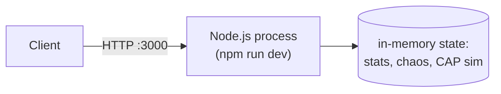
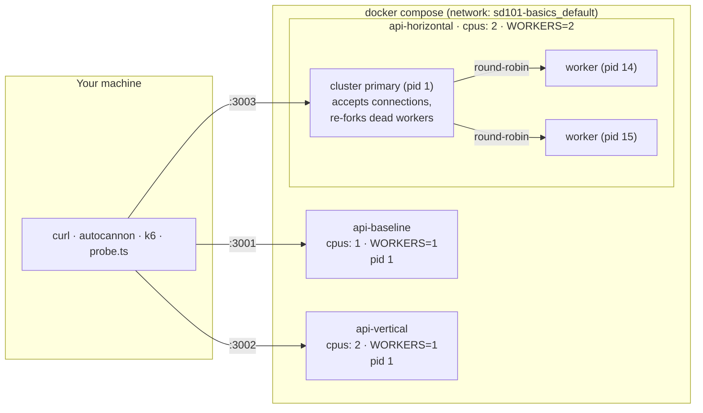
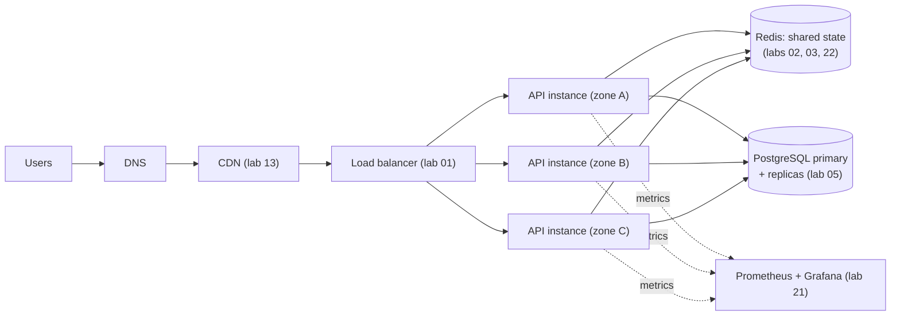

# Architecture: Lab 00

This file describes the **runtime / deployment** architecture: which processes and containers exist and how traffic reaches them.
For the **code** architecture (modules, middleware pipeline) see [docs/architecture.md](docs/architecture.md).

## 1. Simple version: one process

This is where every backend starts: one process, one event loop, state in memory.

- **Strengths:** trivial to run and debug. Thousands of RPS for I/O-bound work.
- **Weaknesses:** one CPU core for JavaScript. One crash = total outage. State lost on restart.

## 2. Lab setup: three scaling variants side by side

### Explanation

| Component | Role | Why it's here |
|---|---|---|
| **api-baseline** | 1 process limited to 1 CPU | The control group. Every comparison is against this |
| **api-vertical** | Same 1 process, now allowed 2 CPUs | Shows vertical scaling. Spoiler: JS still runs on 1 thread |
| **api-horizontal** | Cluster primary + 2 worker processes, 2 CPUs | Horizontal scaling on one machine, plus self-healing |
| **cluster primary** | Owns port 3000, hands each new connection to a worker (round-robin on Linux), forks a replacement when a worker exits | A tiny built-in load balancer + supervisor |
| **Docker** | Enforces CPU/memory limits, runs healthchecks, restarts crashed containers | The outer supervisor |

All three run **the same image**. Only environment variables and resource limits differ, so measured differences come from architecture, not code.

### Ports

| Host port | Container port | Service |
|---|---|---|
| 3000 | n/a | `npm run dev` (not Docker) |
| 3001 | 3000 | api-baseline |
| 3002 | 3000 | api-vertical |
| 3003 | 3000 | api-horizontal |

## 3. Docker configuration explained

| Setting | Value | Why |
|---|---|---|
| `deploy.resources.limits.cpus` | `"1"` / `"2"` | Linux CFS quota: the container may use at most N CPUs' worth of time. This is how we simulate machine sizes |
| `deploy.resources.limits.memory` | `256M` / `512M` | The container is OOM-killed above this. Bounds blast radius |
| `healthcheck` | `wget /health` every 10s, 3 retries | Docker marks the container `unhealthy` if the event loop stops answering. Orchestrators use this to route traffic away |
| `restart: unless-stopped` | | Auto-restart after crashes, but respect manual `docker compose stop` |
| `environment` | `WORKERS`, `INSTANCE_NAME`, `PORT`, `CHAOS_*` | Same image, different behaviour (12-factor config) |
| `ports: "3001:3000"` | host:container | Container always listens on 3000. The host side picks a free port |
| volumes | *none* | The API is stateless and stores nothing worth keeping. Data labs add named volumes |
| `x-api: &api` + `<<: *api` | YAML anchors | Shared config defined once, merged into each service |

Dockerfile highlights ([Dockerfile](Dockerfile)):
- **Multi-stage build:** the TypeScript compiler and dev deps stay in the `build` stage, so the runtime image only has `dist/` + production deps.
- **Layer caching:** `package*.json` is copied before `src/`, so `npm ci` reruns only when dependencies change.
- **`USER node`:** never run as root in a container.
- **`CMD ["node", "dist/server.js"]`:** not `npm start`, so `SIGTERM` reaches Node directly and graceful shutdown works.

## 4. Production version (where later labs take this)

| This lab | Production equivalent |
|---|---|
| cluster primary distributing connections | Load balancer (Nginx, ALB) across machines |
| cluster primary re-forking workers | Kubernetes / ECS restarting pods, auto-scaling groups replacing VMs |
| Docker `cpus` limit | Instance type (t3.small vs c6i.4xlarge) |
| in-memory `/metrics` per process | Prometheus scraping every instance + aggregation |
| in-memory CAP simulator | Real replicated databases (PostgreSQL, Cassandra, etcd) |
| `POST /chaos` | Chaos engineering tools (Chaos Monkey, Gremlin, AWS FIS) |

## 5. Single points of failure in this lab

Spotting SPOFs is a core interview skill. Here they are:

1. **The machine.** All containers run on your laptop. Laptop dies, everything dies.
2. **The cluster primary.** If pid 1 in `api-horizontal` dies, all its workers die with it (Docker then restarts the container).
3. **Each single-process container.** One crash means downtime until restart.
4. **In-memory state.** Metrics, chaos config and CAP data vanish on restart and aren't shared between workers.
