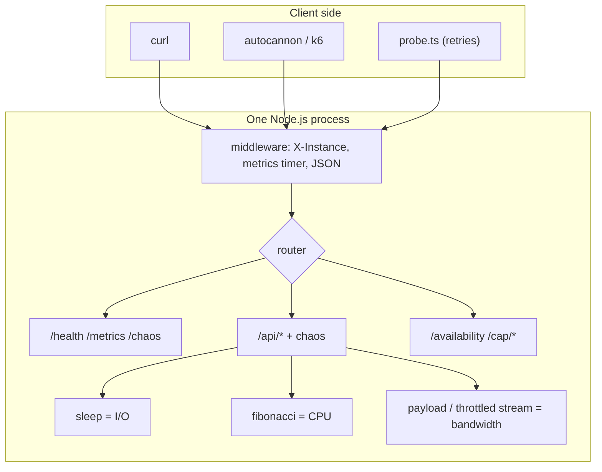

# Concepts: System Design Basics

This lab covers ten foundational concepts. Sections 1–2 give the big picture, section 3 explains each concept in depth with Node.js examples, and sections 4–11 cover how they fit together in practice.

---

## 1. What problem does this solve?

Before you can improve a system you must be able to **describe** and **measure** it.
"The API is slow" isn't actionable. "p99 latency on `GET /orders` went from 120ms to 2.1s after the deploy, while p50 stayed at 40ms" is.

These concepts give you:
- A **shared vocabulary** for discussing designs (with your team, and in interviews)
- **Numbers** to set goals (SLOs) and to check whether a change helped
- **Mental models** to predict where a design breaks *before* you build it

## 2. How does it work?

Every request goes through a **pipeline** of steps: client → network → server → (database / other services) → back. Each step:

- **takes time** → adds to *latency*
- **has a limited capacity** → caps *throughput*
- **moves bytes** → consumes *bandwidth*
- **can fail** → lowers *availability* and *reliability*

System design is about arranging those steps (adding caches, replicas, queues, load balancers) so the overall numbers meet your goals, at an acceptable cost and complexity.

---

## 3. Important terminology

### 3.1 Latency

**Time for one request, start to finish.** Measured in milliseconds.

```text
client latency = network (to) + queueing + processing + network (back)
server latency = queueing + processing          ← what /metrics measures
```

**Percentiles, not averages.** Sort all request times. p50 is the middle one (the "typical" request), p95 is the one 95% of requests beat, p99 is the slowest 1%.

```text
99 requests × 10ms + 1 request × 5000ms
  average = 59.9ms   ← "looks fine"
  p50     = 10ms
  p99     = 10ms     ← with 100 samples, p99 is still a fast one
  max     = 5000ms
2 slow requests out of 100:
  p99     = 5000ms   ← now the tail is visible
```

At 1 million requests/day, the "1%" behind p99 is **10,000 requests**. At Amazon scale, the users with the most items in their cart (big spenders) often hit the slowest path.

**Sequential vs parallel calls.** If a request makes 3 independent 100ms calls:

```ts
// Sequential: 300ms. Each await waits for the previous call.
const user = await getUser(id);
const orders = await getOrders(id);
const recs = await getRecommendations(id);

// Parallel: ~100ms. Total time is the slowest call, not the sum.
const [user, orders, recs] = await Promise.all([getUser(id), getOrders(id), getRecommendations(id)]);
```

**Latency numbers worth knowing** (orders of magnitude):

| Operation | Time |
|---|---|
| Read from memory (Map lookup) | ~100 ns |
| Redis GET (same datacenter) | ~0.5 ms |
| Simple PostgreSQL query with index | ~1–5 ms |
| HTTP call to another service (same region) | ~1–10 ms |
| Read 1 MB from SSD | ~1 ms |
| Round trip US East ↔ US West | ~70 ms |
| Round trip US ↔ Europe | ~80–150 ms |
| Round trip US ↔ Asia | ~150–250 ms |

### 3.2 Throughput

**How many requests complete per second (RPS).**

**Little's Law**, the most useful formula in this course:

```text
throughput = concurrency / latency
   L = λ × W   (items in system = arrival rate × time in system)

100 requests in flight, each taking 0.1s  →  1000 RPS
same 100 in flight, latency grows to 1s   →  100 RPS   ← slow dependency = less capacity
```

**I/O-bound vs CPU-bound in Node.js:**

```ts
// I/O-bound: the event loop is FREE while waiting. Thousands can wait concurrently.
app.get("/io", async (_req, res) => {
  await db.query("SELECT ...");        // Node hands this to the OS / libuv and serves others
  res.json({ ok: true });
});

// CPU-bound: the event loop is BUSY. Nobody else gets served until it finishes.
app.get("/cpu", (_req, res) => {
  const result = fibonacci(40);         // ~1 second of pure JavaScript on the ONE main thread
  res.json({ result });
});
```

Node.js runs your JavaScript on a **single thread** (the event loop). That makes it excellent for I/O-heavy APIs (most web backends) and bad at CPU-heavy work (image processing, big JSON transforms, crypto in JS, report generation) unless you use worker threads, more processes, or offload to a queue.

**Event-loop delay** measures how late timers fire. A healthy server shows ~0–20ms. A blocked one shows hundreds of ms or more. This lab exposes it at `/metrics → runtime.eventLoopDelayMs`.

### 3.3 Bandwidth

**How many bytes per second a link can carry.** Latency is the *length* of the pipe, bandwidth is its *width*.

```text
time to transfer ≈ latency + size / bandwidth

1 KB response,  100ms latency, 10 MB/s   →  ~100ms   (latency dominates)
50 MB response, 100ms latency, 10 MB/s   →  ~5.1s    (bandwidth dominates)
```

**Ways to use less bandwidth:**
- Compression (`gzip`, `brotli`): JSON typically shrinks 80–95%
- Pagination: don't return 10,000 rows at once
- Field selection: return only the fields the client needs
- CDN (lab 13): serve big static files from close to the user

```ts
import compression from "compression";
app.use(compression()); // only compresses when the client sends Accept-Encoding: gzip
```

**Throughput vs bandwidth:** bandwidth is the *capacity* of the link, throughput is what you *actually* achieve. A 1 Gbps link carrying 200 Mbps has 200 Mbps throughput.

### 3.4 Availability

**The fraction of time the system serves requests successfully.**

```text
availability = uptime / (uptime + downtime)
             = successful requests / total requests   (request-based, more common today)
```

| Availability | "Nines" | Downtime per year | Downtime per month |
|---|---|---|---|
| 99% | two nines | 3d 15h | 7h 18m |
| 99.9% | three nines | 8h 45m | 43m 50s |
| 99.99% | four nines | 52m 36s | 4m 23s |
| 99.999% | five nines | 5m 16s | 26s |

**Series** (all components required, A → B → C):

```text
A_total = A₁ × A₂ × A₃
API 99.9% → DB 99.9% → Payment provider 99.9%   =   99.7%
```
Every dependency you add *lowers* your availability, so you can never be more available than your least available hard dependency.

**Parallel** (redundant replicas, any one is enough):

```text
A_total = 1 − (1 − A)ⁿ
two 99% replicas    = 1 − 0.01²  = 99.99%
three 99% replicas  = 1 − 0.01³  = 99.9999%
```
**Caveat:** this assumes failures are *independent*. Two replicas on the same host, the same bad config, or the same region fail together.

**SLA / SLO / SLI:**
- **SLI** (indicator): what you measure, e.g. % of requests that succeed in < 300ms
- **SLO** (objective): your internal target, e.g. SLI ≥ 99.9% over 30 days
- **SLA** (agreement): the contractual promise to customers, with penalties. Usually looser than the SLO.
- **Error budget** = 100% − SLO. With 99.9%, you may "spend" 43 minutes/month on failures and risky deploys.

### 3.5 Reliability

**The system consistently does the *correct* thing over time.** Availability asks "did it respond?"; reliability asks "was the response *right*, and does it keep being right?"

- A server that is up but returns wrong prices is **available but unreliable**.
- Common metrics: error rate, **MTBF** (mean time between failures), **MTTR** (mean time to recovery).
- `availability ≈ MTBF / (MTBF + MTTR)`, so you can raise availability by failing less often *or* by recovering faster. In practice, cutting MTTR (automation, restarts, rollbacks) is usually cheaper.

**Clients can add reliability on top of an unreliable server.** That's what retries do:

```text
server fails 20% of requests (independent failures)
1 attempt:      success = 80%
up to 3 tries:  success = 1 − 0.2³ = 99.2%
cost:           average calls per request = 1 + 0.2 + 0.04 = 1.24  (24% more load)
```

### 3.6 Fault tolerance

**The system keeps working, possibly degraded, when components fail.** Built from:

| Technique | Example in this lab / course |
|---|---|
| Redundancy | 2 cluster workers. One dies, the other serves |
| Supervision / auto-restart | cluster primary re-forks workers. Docker `restart: unless-stopped` |
| Retries | `scripts/probe.ts --retries 2` |
| Timeouts | lab 19 |
| Circuit breakers | lab 18 |
| Graceful degradation | serve cached data when the DB is down (lab 02) |

```ts
// server.ts: the cluster primary is a tiny supervisor
cluster.on("exit", (worker) => {
  log("warn", "worker died - forking a replacement", { workerPid: worker.process.pid });
  cluster.fork();
});
```

**High availability vs fault tolerance:** HA aims to minimize downtime (a brief blip during failover is OK). Strict fault tolerance aims for *zero* visible interruption. Most web systems target HA.

### 3.7 Scalability

**The ability to handle more load by adding resources, with cost growing roughly linearly.**

Scalability is not the same as performance:
- **Performance problem:** slow for one user.
- **Scalability problem:** fast for one user, slow under heavy load.

Dimensions: more **requests** (RPS), more **data** (TB), more **users/regions**, more **engineers** (organizational scaling, the reason for microservices).

### 3.8 Vertical scaling (scale up)

**Make one machine bigger:** more CPU, RAM, faster disk.

- ✅ No code changes. No distributed-systems problems.
- ❌ Hard ceiling (the biggest machine money can buy). Cost grows faster than capacity at the high end. Still a single point of failure. Upgrades often need downtime.
- ⚠️ **Node.js gotcha:** one Node process executes JavaScript on one core. Moving it from 1 CPU to 2 CPUs barely helps CPU-bound work (experiment 5). You must also run more processes.

### 3.9 Horizontal scaling (scale out)

**Add more machines or processes and spread the load.**

- ✅ Nearly unlimited. Redundancy comes for free (one dies, others serve). Can use cheap commodity machines.
- ❌ Needs a load balancer (lab 01). Services must be **stateless** (lab 22). Introduces distributed-systems problems: consistency, partial failure, coordination.

In Node.js, the first step is the built-in `cluster` module (or PM2, or multiple containers/pods):

```ts
import cluster from "node:cluster";
import os from "node:os";

if (cluster.isPrimary) {
  for (let i = 0; i < os.availableParallelism(); i++) cluster.fork();
} else {
  app.listen(3000); // all workers share port 3000
}
```

**The state problem, live in this lab:** with `WORKERS=2`, call `/metrics` a few times and the numbers change depending on which worker answers, because each worker has its own in-memory `StatsService`. The same problem hits sessions, caches, rate-limit counters and WebSocket rooms. The fix is to move shared state out of the process (Redis, Postgres).

### 3.10 CAP theorem

In a distributed data store, when a **network Partition** happens, you can guarantee **Consistency** *or* **Availability**, not both.

- **C**onsistency: every read returns the most recent write (or an error).
- **A**vailability: every request to a non-failed node gets a non-error response.
- **P**artition tolerance: the system continues operating despite lost messages between nodes.

Networks *will* partition (cable cuts, switch failures, GC pauses, cloud zone issues), so a distributed system must tolerate P. **The real choice is C vs A while a partition is happening.**

```text
         Node A ──── ✂ ──── Node B
   user writes x=2 to A   user reads x from B

   CP choice: B refuses ("I can't confirm I'm up to date") → error, but never wrong
   AP choice: B answers x=1 (stale) → available, but inconsistent until healed
```

| System | Leans | Behaviour during partition |
|---|---|---|
| etcd, ZooKeeper, Consul | CP | Minority side refuses writes |
| PostgreSQL primary + sync replica | CP | Writes block if sync replica unreachable |
| Cassandra, DynamoDB (default), Riak | AP | Accept writes, reconcile later |
| DNS | AP | Serves cached (possibly stale) records |

**"CA" isn't a real option for distributed systems.** A system that can't tolerate partitions is a single-node system. **PACELC** extends CAP: *if Partition, choose A or C; Else (normal operation), choose Latency or Consistency.* Even without partitions, synchronous replication (consistency) costs latency.

**Conflict resolution in AP systems:** Last-Write-Wins (simple, silently loses data, as demonstrated in experiment 8), vector clocks, CRDTs, or application-level merging (e.g. shopping cart union).

---

## 4. Architecture



See [ARCHITECTURE.md](ARCHITECTURE.md) for deployment variants and [docs/architecture.md](docs/architecture.md) for code structure.

## 5. Request lifecycle

1. **Client opens TCP connection** (or reuses a keep-alive one) and sends `GET /api/latency?ms=100`.
2. **Network hop**: host → Docker port mapping → container. Adds latency you don't control.
3. **In cluster mode**, the primary accepts the connection and hands it to a worker (round-robin).
4. **Middleware**: set `X-Instance`, start the latency timer, parse the body.
5. **Routing**: Express matches `/api/latency`.
6. **Chaos middleware**: optional extra delay, optional injected 500.
7. **Controller**: validates `ms` (400 if invalid), awaits `sleep(100)`. The event loop is free meanwhile.
8. **Response** serialized as JSON. On `finish`, the timer stops and `StatsService.record()` stores the duration.
9. **Network hop back**. The client's measured latency = server time + network.

Failures can occur at 1–2 (connection refused/timeouts), 3 (worker dead), 6 (injected), 7 (validation, blocked event loop).

## 6. Advantages

(Of *measuring with these concepts* and of the simple designs in this lab.)
- Percentiles reveal problems averages hide.
- Little's Law lets you estimate capacity on a napkin.
- Availability math tells you *before building* whether a design can meet its SLO.
- `cluster` gives multi-core usage and crash recovery with ~20 lines of code.

## 7. Disadvantages

- In-memory metrics are per-process and reset on restart, so they're not production observability (lab 21).
- `cluster` scales only within one machine and doesn't protect against machine failure.
- Retries improve success rate but amplify load. Without backoff they can cause outages.
- AP systems need conflict resolution. CP systems sacrifice uptime.

## 8. When should we use it?

- **Always** measure latency percentiles, error rate and throughput for any service you run.
- **Always** do availability math when adding a hard dependency.
- Use `cluster`/multiple processes when a Node service is CPU-limited on a multi-core machine.
- Prefer **CP** for money, inventory counts, uniqueness constraints (usernames), leader election.
- Prefer **AP** for feeds, likes, view counters, shopping carts, caches, DNS-like data.

## 9. When should we NOT use it?

- Don't add horizontal scaling before you've measured a bottleneck. A single well-written Node process handles thousands of RPS of I/O-bound traffic.
- Don't use `cluster` in Kubernetes/ECS when the orchestrator already runs one process per container. Scale with replicas instead (simpler, better isolation).
- Don't chase five nines when your dependencies offer three. Series math makes it impossible.
- Don't add retries to non-idempotent operations (payments!) without idempotency keys (lab 20).

## 10. Common mistakes

| Mistake | Why it hurts | Instead |
|---|---|---|
| Reporting average latency | Hides the slow tail users feel | p50 / p95 / p99 |
| Benchmarking with 1 connection | Measures latency, not throughput | Use concurrency (`-c 100`) |
| Benchmarking on the same laptop as the server | Load generator steals CPU from the server | Separate machines for real tests. Treat laptop numbers as *relative* |
| Sequential `await`s for independent calls | Latency adds up | `Promise.all` |
| CPU-heavy work on the event loop | Blocks every request | worker_threads, queue, separate service |
| Thinking more CPU = faster Node | One process ≈ one core | More processes |
| Storing state in process memory | Breaks with >1 instance, lost on restart | Redis / DB |
| Unlimited retries | Retry storms amplify outages | Limit + exponential backoff + jitter |
| Assuming replicas fail independently | Same bug or zone takes all down | Spread across zones, staggered deploys |
| "We're CA" | Partitions happen anyway | Decide C vs A explicitly |

## 11. Production considerations

- **Observability:** export latency histograms, error rates, RPS, event-loop delay, memory to Prometheus (lab 21). Alert on SLO burn rate, not on single spikes.
- **Capacity planning:** measure max RPS per instance at your p99 target, then `instances = peak RPS / RPS per instance × 1.5` headroom (plus N+1 for failures).
- **Redundancy:** ≥2 instances in ≥2 availability zones for anything user-facing.
- **Supervision:** let the orchestrator (Docker, Kubernetes, systemd) restart crashed processes. Handle `SIGTERM` for graceful shutdown.
- **Input limits:** cap every user-controlled size or iteration count (`MAX_CPU_N`, `MAX_PAYLOAD_KB`, `express.json({ limit })`).
- **Timeouts everywhere:** a request with no timeout can hold a connection forever (lab 19).
- **Data stores:** know whether each store you use is CP or AP under partition, and design for its failure mode.
