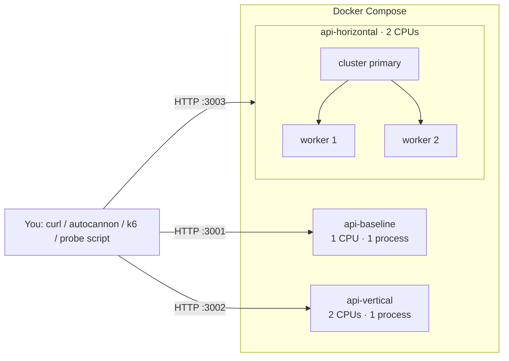

# Lab 00: System Design Basics

> Latency · Throughput · Bandwidth · Availability · Reliability · Fault tolerance · Scalability (vertical vs horizontal) · CAP theorem

Every later lab (load balancers, caches, queues, replication...) is a tool for improving one of the numbers you learn to **measure** here. This lab gives you the vocabulary, and a small API you can break to watch the numbers move.

---

## Goal

By the end of this lab you will be able to:

- Measure **latency** as p50/p95/p99 and explain why averages lie
- Measure **throughput** (RPS) and predict it with **Little's Law**
- Show that **bandwidth** and latency are different things, and how compression helps
- Calculate **availability** ("nines"), and how dependencies and replicas change it
- Tell **availability**, **reliability** and **fault tolerance** apart, with a demo of each
- Explain why **vertical scaling** barely helps a single Node.js process, and why **horizontal scaling** does
- Explain the **CAP theorem** by running a partition yourself and watching CP refuse while AP serves stale data

## Prerequisites

| Tool | Version | Check |
|---|---|---|
| Node.js | 22+ | `node -v` |
| npm | 10+ | `npm -v` |
| Docker Desktop | with Compose v2+ | `docker compose version` |
| curl | any | `curl --version` |
| Git Bash (Windows) | any | commands in this lab are written for bash |

No prior system design knowledge needed.

---

## System Design Concept

A **system** is anything that takes requests and returns responses: one Express server, or 500 microservices. "System design" is deciding how to arrange the pieces so the system stays **fast**, **up**, and **correct** as load grows and parts break.

To talk about "fast", "up" and "correct" precisely, engineers use a few numbers:

| Question | Concept | Unit |
|---|---|---|
| How long does *one* request take? | **Latency** | ms (p50 / p95 / p99) |
| How many requests per second can we handle? | **Throughput** | RPS |
| How many bytes per second fit through the network? | **Bandwidth** | MB/s, Mbps |
| What fraction of the time are we up? | **Availability** | % ("nines") |
| Do we do the *right* thing, consistently? | **Reliability** | error rate, MTBF |
| Do we survive a part breaking? | **Fault tolerance** | yes / degraded / no |
| Can we handle 10× the load by adding resources? | **Scalability** | cost per RPS |
| When the network splits, do we stay correct or stay up? | **CAP** | CP or AP |

**Analogy: a coffee shop.**
- *Latency* = how long one customer waits for their coffee.
- *Throughput* = coffees served per hour.
- *Bandwidth* = how wide the door is (how many people can walk in at once).
- *Availability* = the % of opening hours the shop is actually open.
- *Reliability* = the % of orders that come out *right*.
- *Fault tolerance* = one barista calls in sick and the shop still runs.
- *Vertical scaling* = buy a faster espresso machine. *Horizontal scaling* = hire more baristas.
- *CAP* = two branches share a loyalty-points system and the phone line between them dies. Either stop giving points (consistent, not available) or keep giving points and reconcile later (available, temporarily inconsistent).

Read [CONCEPTS.md](CONCEPTS.md) for the full explanation of each concept with Node.js examples.

## Why does this problem exist?

On your laptop, with one user (you), everything is fast and up. Problems appear when:

1. **Load grows.** 1 user becomes 10,000. Each request needs CPU, memory and network, and those are finite.
2. **Things fail.** Processes crash, disks fill, networks drop packets, deploys go wrong. At scale, *something* is always broken.
3. **Distance is real.** Light needs about 70ms to cross the Pacific and back. Every network hop adds latency.
4. **Node.js has one thread for your JavaScript.** CPU-heavy work in one request blocks every other request on that process.

You can't fix what you can't measure, so this lab is mostly about **measuring**.

## Real-world examples

- **Amazon** famously measured that every extra 100ms of latency cost them about 1% in sales, so latency is money.
- **Google SRE** runs everything on *error budgets*: a 99.9% SLO means 43 minutes of allowed downtime per month, and teams "spend" that budget on risky deploys.
- **AWS S3** advertises 99.99% availability by storing data redundantly across availability zones (parallel availability).
- **Discord / Slack outages** are often a dependency chain: one internal service fails, and everything that depends on it in *series* fails too.
- **DynamoDB / Cassandra** are AP-leaning: they stay writable during partitions and reconcile later. **Zookeeper / etcd** are CP: they refuse writes without a majority.

---

## Architecture



All three containers run **the same image** with different settings, so any performance difference comes from *configuration*, not code. Details: [ARCHITECTURE.md](ARCHITECTURE.md), code structure: [docs/architecture.md](docs/architecture.md).

## Request Flow

```text
Client (curl)
  │  1. TCP connect + HTTP request             ── network hop (host → Docker → container)
  ↓
Node.js process (or cluster primary → worker)
  │  2. instance-header middleware             ── adds X-Instance: name/pid
  │  3. request-metrics middleware             ── starts a timer
  │  4. express.json()                         ── parses body (POST only)
  │  5. router matches /api/latency
  │  6. chaos middleware                       ── maybe adds delay, maybe throws 500
  │  7. controller                             ── validates query, does the work (sleep / fib / build JSON)
  ↓
  8. Response JSON  ──→  timer stops, StatsService.record(route, ms, status)
  ↓
Client receives response                       ── network hop back
```

Failure points: the process is dead (connection refused), the event loop is blocked (slow), chaos injects a 500, or validation fails (400). Full walkthrough: [docs/request-flow.md](docs/request-flow.md).

## Implementation

```text
00-basics/
├── src/
│   ├── server.ts                 # entry: single process OR cluster (primary + workers)
│   ├── app.ts                    # builds the Express app (used by server + tests)
│   ├── config/index.ts           # typed, validated env config
│   ├── routes/index.ts           # route map
│   ├── controllers/              # one per concept: latency, throughput, bandwidth, availability, cap, system
│   ├── services/                 # the logic: stats (percentiles), cpu (fib), chaos, availability math, CAP simulator
│   ├── middleware/               # metrics timer, chaos, X-Instance header, error handler
│   └── utils/                    # typed errors, query validation, sleep, logger
├── tests/                        # vitest + supertest (34 tests)
├── scripts/probe.ts              # client-side availability/latency probe with retries
├── k6/load-test.js               # k6 ramp-up load test
├── Dockerfile                    # multi-stage build, non-root, healthcheck
└── docker-compose.yml            # baseline / vertical / horizontal containers
```

### Endpoints

| Endpoint | Concept | Try |
|---|---|---|
| `GET /health` | liveness | `curl localhost:3000/health` |
| `GET /metrics` | RPS, error rate, p50/p95/p99, event-loop delay, memory | `curl localhost:3000/metrics` |
| `GET /api/hello` | baseline throughput | `curl localhost:3000/api/hello` |
| `GET /api/latency?ms=100&tailRate=0.02&tailMs=1000` | latency, tail latency | |
| `GET /api/latency/sequential?calls=3&ms=100` | latency adds up (~300ms) | |
| `GET /api/latency/parallel?calls=3&ms=100` | latency overlaps (~100ms) | |
| `GET /api/io?ms=100` | I/O-bound throughput | |
| `GET /api/cpu?n=30` | CPU-bound throughput, event-loop blocking | |
| `GET /api/payload?kb=200` | bandwidth + gzip | `curl --compressed ...` |
| `GET /api/download?kb=200&kbps=50` | bandwidth limit (≈4s) | |
| `GET /availability?percent=99.9&replicas=2&dependencies=3` | nines, series, parallel | |
| `POST /chaos` `{"failureRate":0.2,"extraLatencyMs":0}` | break `/api/*` on purpose | |
| `POST /chaos/reset` · `GET /chaos` | | |
| `POST /chaos/crash` | kill the process (fault tolerance) | |
| `POST /metrics/reset` | clear stats between experiments | |
| `/cap/*` | CAP simulator (see [EXPERIMENTS.md](EXPERIMENTS.md#experiment-8--cap-theorem-cp-vs-ap)) | |

Key code to read first:
- [src/services/stats.service.ts](src/services/stats.service.ts): how percentiles and RPS are computed
- [src/server.ts](src/server.ts): cluster mode and worker re-forking
- [src/services/cap.service.ts](src/services/cap.service.ts): CP vs AP in ~150 lines
- [src/services/availability.service.ts](src/services/availability.service.ts): series and parallel availability

---

## How to Run

### Option A: locally with Node (fastest feedback)

```bash
cd 00-basics
npm install          # install dependencies from package-lock.json
cp .env.example .env # optional: the defaults work without it
npm run dev          # start with tsx watch: restarts on every file save, port 3000
```

> `npm run dev` does **not** read `.env` automatically. Set variables inline instead: `WORKERS=2 npm run dev`.

### Option B: production build locally

```bash
npm run build        # compile TypeScript (src/) → JavaScript (dist/) with strict type checking
npm start            # run the compiled dist/server.js with plain node
```

### Option C: Docker (used by most experiments)

```bash
docker compose up --build      # build the image, start 3 containers, stream logs (Ctrl+C to stop)
docker compose up --build -d   # same, in the background (detached)
docker compose ps              # status + health of each container
docker compose logs -f         # follow logs of all containers
docker compose down            # stop and remove containers + network
```

`docker compose down -v` also deletes volumes. This lab has none (the API is stateless), but you'll need `-v` in the database labs to reset data.

| URL | Container | Resources |
|---|---|---|
| http://localhost:3000 | `npm run dev` | your whole machine |
| http://localhost:3001 | `api-baseline` | 1 CPU, 1 process |
| http://localhost:3002 | `api-vertical` | 2 CPUs, 1 process |
| http://localhost:3003 | `api-horizontal` | 2 CPUs, 2 processes (cluster) |

## How to Test

```bash
npm test             # run all 34 tests once (vitest)
npm run test:watch   # re-run tests on file change
npm run typecheck    # strict type-check src + tests + scripts, no output files
```

What the tests prove: percentile math, RPS windowing, availability formulas, CAP behaviour (CP refuses, AP diverges, LWW discards), chaos injection, compression, throttled download timing, and the HTTP error format.

Manual smoke test:

```bash
curl -s localhost:3001/health
curl -s "localhost:3001/api/latency/sequential?calls=3&ms=100"   # serverMs ≈ 300
curl -s "localhost:3001/api/latency/parallel?calls=3&ms=100"     # serverMs ≈ 100
```

## Experiments

Full step-by-step instructions with expected output: **[EXPERIMENTS.md](EXPERIMENTS.md)**.

| # | Experiment | What you'll see (measured on a laptop, yours will differ) |
|---|---|---|
| 1 | Latency: sequential vs parallel | 3×100ms calls: ~307ms sequential, ~106ms with `Promise.all` |
| 2 | Tail latency | 2% slow requests: p50 = 52ms, **avg = 70ms**, p95 = 57ms, **p99 = 1001ms** |
| 3 | I/O throughput + Little's Law | 100 connections × 100ms ⇒ ≈1000 RPS theoretical, ~700 measured |
| 4 | CPU throughput + event-loop blocking | `/health` jumps from **5ms to 2.5s** while fib runs |
| 5 | Vertical vs horizontal scaling | 2 CPUs + 1 process ≈ 1 CPU. 2 processes ≈ 1.3–2× |
| 6 | Bandwidth + compression | 200KB JSON → **9KB** gzipped; 100KB at 50KB/s takes 2s |
| 7 | Availability & reliability under chaos | 20% failures: **78.6%** success; with 2 retries **98.4%** (+26% load) |
| 8 | CAP theorem | CP → HTTP 503 during partition; AP → stale reads, LWW **loses** a write |
| 9 | Fault tolerance | single process crash: ~2s of refused connections. Cluster worker crash: **0** errors |
| 10 | k6 load test with SLO thresholds | pass/fail against p95 < 500ms and < 1% errors |

## What happens if X fails?

| Failure | What the user sees | Why | Fix (later labs) |
|---|---|---|---|
| The only process crashes (`npm run dev`) | Connection refused, forever | Nothing restarts it: single point of failure | Supervisor (Docker restart, systemd, k8s) |
| The process crashes in Docker | ~1–3s of connection refused | Docker restarts the container (`restart: unless-stopped`) | Run ≥2 instances behind a load balancer (lab 01) |
| One cluster worker crashes | Requests on *that* worker fail. Others are fine | Primary forks a replacement | Same idea at machine level = lab 01, 22 |
| A CPU-heavy request arrives | **Every** request on that process waits | Single-threaded event loop | Worker threads, more processes, offload to a queue (lab 08) |
| 20% of requests error | 1 in 5 users sees a 500 | Unreliable server | Retries with backoff (lab 19), circuit breaker (lab 18) |
| Network partition between replicas | CP: errors. AP: stale/conflicting data | CAP theorem | Quorums, conflict resolution (labs 05, 06) |
| Slow dependency (`extraLatencyMs`) | Latency rises, and throughput falls at the same concurrency | Little's Law | Timeouts (lab 19), caching (lab 02) |

## Scaling

```text
Simple                               Production
──────                               ──────────
1 Node process                       Many processes per machine (cluster / PM2 / k8s pods)
on 1 machine                         × many machines
                                     behind a load balancer (lab 01)
in-memory state (stats, CAP sim)     shared state in Redis / Postgres (labs 02, 03, 22)
```

1. **Vertical**: give the machine more CPU/RAM. For Node, this only helps if you also run more processes.
2. **Horizontal on one machine**: `cluster`, which this lab's `WORKERS=N` setting does.
3. **Horizontal across machines**: a load balancer plus N servers (lab 01, lab 22).

## Bottlenecks

- **CPU on the event loop.** One CPU-bound request blocks the whole process (experiment 4).
- **In-process state.** `/metrics`, chaos settings and the CAP simulator live in *one* process's memory. In cluster mode each worker has its own copy, so `POST /chaos` only affects whichever worker received it. This is the core reason services must be **stateless** to scale horizontally (lab 22).
- **Network.** Docker Desktop's port forwarding added ~20ms per request on the test machine and capped I/O throughput at ~700 RPS instead of 1000.
- **Bandwidth.** Big payloads cost time on slow links. Compression trades CPU for bytes.

## Trade-offs

| Decision | You gain | You pay |
|---|---|---|
| More processes (horizontal) | Use all cores, survive a worker crash | More memory, no shared in-memory state |
| Bigger machine (vertical) | Zero code changes | Hard ceiling, still a single point of failure, wasted cores for 1 Node process |
| Retries | Higher success rate | More load on an already failing server, higher tail latency |
| gzip compression | ~95% fewer bytes | CPU per response |
| CP | Never returns stale data | Errors during partitions |
| AP | Always answers | Stale reads, lost writes under LWW |

More in [docs/trade-offs.md](docs/trade-offs.md).

## Production Considerations

- **Use percentiles and SLOs**, not averages. Alert on p99 and error rate (lab 21 adds Prometheus + Grafana).
- **Monitor event-loop delay.** It's the earliest sign a Node service is CPU-starved.
- **Never run a single instance** of anything important: always ≥2, behind a load balancer, ideally in different zones.
- **Graceful shutdown.** `server.ts` handles `SIGTERM` so in-flight requests finish during deploys.
- **Supervise processes.** Docker `restart`, Kubernetes, systemd. Don't rely on `cluster` alone.
- **Bound every input.** `MAX_CPU_N` and `MAX_PAYLOAD_KB` exist because unbounded input is a denial-of-service vector.
- **Retries need limits, backoff, jitter and idempotency** (labs 19, 20). Experiment 7 shows they multiply load.

## Interview Questions

15 questions with answers (beginner → advanced): **[INTERVIEW.md](INTERVIEW.md)**. A sample:

- Why report p99 latency instead of average latency?
- Two services each with 99.9% availability, called in series: what's the combined availability?
- Why doesn't giving a Node.js server more CPU cores make it faster?
- Explain the CAP theorem with a concrete example. Is "CA" a real option?

## Key Takeaways

1. **Latency is a distribution.** Report p50/p95/p99. The average hides your unhappiest users.
2. **Throughput = concurrency / latency** (Little's Law). Lower latency raises capacity.
3. **Bandwidth ≠ latency.** Big payloads are slow on slow links, and compression helps.
4. **Dependencies multiply availability down. Replicas raise it.** 99.9%³ = 99.7%. Two 99% replicas = 99.99%.
5. **Available ≠ reliable ≠ fault tolerant.** Up, correct, and survives failures are three different properties.
6. **Node.js uses one core per process for JS.** Scale with more processes, not just bigger machines.
7. **Partitions happen, so CAP is a choice between C and A *during* a partition.**
8. **In-memory state blocks horizontal scaling.** You saw it with per-worker `/metrics`.

Next lab: [01-load-balancer](../01-load-balancer/), which puts several of these servers behind Nginx.
