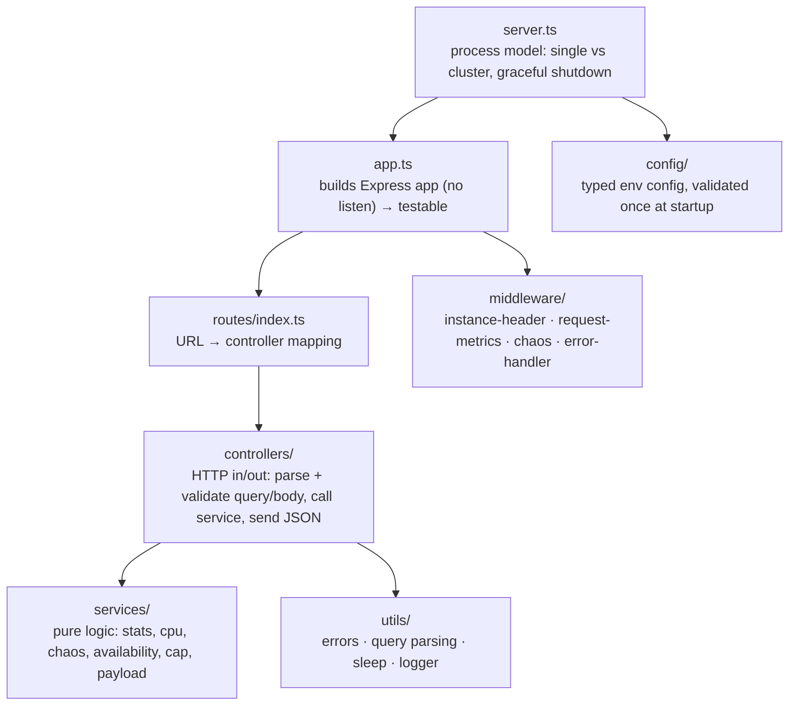

# Code Architecture

How the TypeScript code is organized, and why. For containers and processes see [../ARCHITECTURE.md](../ARCHITECTURE.md).

## Layers



| Layer | Knows about HTTP? | Tested by |
|---|---|---|
| `services/` | ❌ no, plain TypeScript | unit tests (`stats.test.ts`, `cap.test.ts`, ...) |
| `controllers/` | ✅ `Request` / `Response` | HTTP tests via supertest (`app.test.ts`) |
| `middleware/` | ✅ | HTTP tests |
| `server.ts` | starts processes | manual / Docker experiments |

**Rule:** services never import Express. That keeps the interesting logic (percentiles, CAP, availability math) easy to read and unit-test.

## Dependency injection, without a framework

```ts
// services/index.ts
export function createServices(config: AppConfig): Services {
  return { config, stats: new StatsService(), runtime: new RuntimeService(),
           chaos: new ChaosService({ ...config.chaos }), cap: new CapCluster() };
}

// controllers receive what they need:
export function createLatencyController({ config }: Services) { ... }

// tests can swap any piece, e.g. a deterministic random():
new ChaosService({ failureRate: 0.5, extraLatencyMs: 0 }, () => 0.1);
```

Each `createApp(services)` call gets **fresh** state, so tests don't leak into each other.

## Middleware pipeline (order matters)

```text
request
  → instanceHeader      sets X-Instance (must be first so even errors carry it)
  → requestMetrics      starts timer; on 'finish' records route + duration + status
  → express.json()      parses JSON bodies (100kb limit)
  → router
       /api/*  → rememberMountPath → [route] → chaos → (compression) → controller
       /cap/*  → rememberMountPath → [route] → controller
       others  → controller
  → notFound            404 JSON
  → errorHandler        HttpError → its status, invalid JSON → 400, anything else → 500
response
```

Two subtle details worth reading in the code:

1. **Chaos is attached per route, not with `api.use()`.** If chaos ran before routing, `req.route` would be unset when it throws, and `/metrics` would log the error under `unmatched`. See [routes/index.ts](../src/routes/index.ts).
2. **`rememberMountPath`.** Express resets `req.baseUrl` when an error bubbles out of a sub-router, so a failed `GET /api/latency` would be recorded as `GET /latency`. The middleware stores the mount path in `res.locals` first. See [request-metrics.ts](../src/middleware/request-metrics.ts).

Both were real bugs caught by tests while building this lab, which shows why measuring the measuring code matters.

## Error handling

```ts
// utils/errors.ts
class HttpError extends Error { statusCode; code; }
class BadRequestError extends HttpError        // 400
class ServiceUnavailableError extends HttpError // 503 (CP mode refusal)
class ChaosError extends HttpError              // 500 (injected)
```

Controllers just `throw new BadRequestError("...")`. Express 5 forwards errors from async handlers to `errorHandler` automatically (Express 4 needed wrappers). Every error response has the same shape:

```json
{ "error": { "code": "BAD_REQUEST", "message": "\"ms\" must be an integer between 0 and 30000" },
  "instance": "baseline-1cpu-1proc", "pid": 1 }
```

## Configuration

[config/index.ts](../src/config/index.ts) reads env vars **once**, validates ranges, and exports a frozen, typed `AppConfig`. Bad config crashes at startup with a clear message (`ConfigError: WORKERS must be a number between 0 and 64, got "abc"`) instead of misbehaving later.

## TypeScript strictness

[tsconfig.json](../tsconfig.json) enables `strict`, `noUncheckedIndexedAccess` (array/map reads may be `undefined`, which you'll see `?? 0` in percentile code), `exactOptionalPropertyTypes`, and `noUnused*`. No `any` anywhere: JSON bodies are typed `unknown` and validated (`parseChaosPatch`, `isNodeId`).
