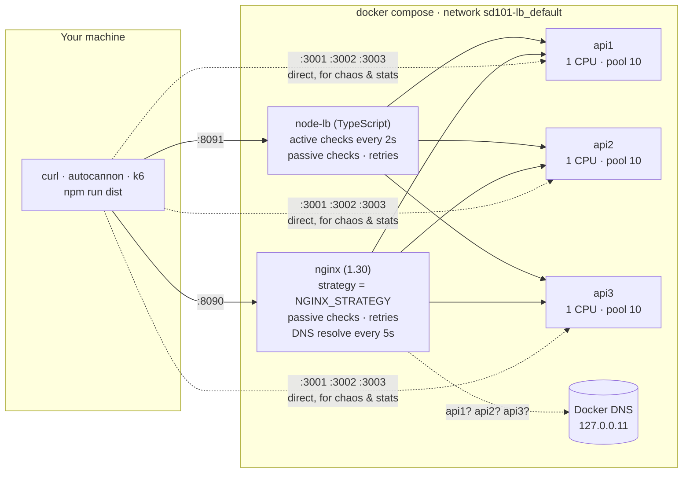
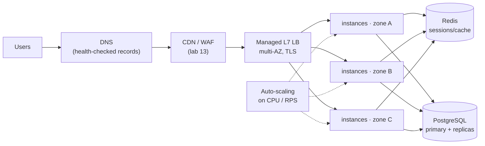

# Architecture: Lab 01

Runtime and deployment architecture. For the code structure see [docs/architecture.md](docs/architecture.md).

## 1. Simple version (Lab 00): one server


One address, one process. Capacity ≈ 100 req/s (pool of 10 × 100ms queries). If it dies, everything is down.

## 2. This lab



### Components

| Component | Role | Key settings |
|---|---|---|
| **nginx** | Production-grade L7 load balancer / reverse proxy | `upstream` per strategy, `max_fails=2 fail_timeout=10s`, `proxy_next_upstream error timeout http_5xx`, `proxy_connect_timeout 1s`, `proxy_read_timeout 5s`, `keepalive 32`, `resolve` |
| **node-lb** | The same job in ~400 lines of TypeScript, built to be read | 4 strategies, active health checks (2s interval, 1s timeout, thresholds 2/2), passive checks, 1 retry for GET/HEAD, keep-alive agent |
| **api1–3** | Identical stateless-ish Express apps (except the cart) | 1 CPU, 256 MB, `POOL_SIZE=10`, `DRAIN_MS=6000`, `stop_grace_period: 15s` |
| **Docker DNS** | Resolves service names to container IPs. Stopped containers disappear from DNS | Nginx re-resolves every 5s (`valid=5s`) |

### Why two load balancers?

Nginx is what you'd deploy. The TypeScript LB exists so you can **read** what a load balancer does: about 60 lines for strategies, 70 for health checks, 150 for proxying. It also has **active** health checks, which open-source Nginx lacks, so experiment 7 can compare them side by side. Don't run your own LB in production.

### Ports

| Host | Container | Service |
|---|---|---|
| 8090 | 80 | nginx |
| 8091 | 8091 | node-lb |
| 3001 / 3002 / 3003 | 3000 | api1 / api2 / api3 (bypassing any LB) |

## 3. Docker configuration explained

| Setting | Where | Why |
|---|---|---|
| `image: sd101-lb-app:latest` + `build` | api1-3, node-lb | One image, two programs. `command:` picks `dist/api/server.js` or `dist/lb/server.js` |
| `deploy.resources.limits.cpus: "1"` | api1-3 | Each instance = one CPU, like separate small VMs |
| `healthcheck` (wget `/health`) | all | Docker's own view of health. `depends_on: condition: service_healthy` waits for it |
| `depends_on ... service_healthy` | nginx, node-lb | Don't start LBs before backends are ready |
| `restart: unless-stopped` | all | Crashed processes come back (`/admin/crash`), manual stops are respected (`docker kill` too!) |
| `stop_grace_period: 15s` | api1-3 | Time between SIGTERM and SIGKILL. Must exceed DRAIN_MS + longest request. The default here was only 3s |
| `DRAIN_MS: "6000"` | api1-3 | How long `/health` reports 503 before the server closes. Must exceed LB detection time (~4s) |
| volumes (bind mounts, `:ro`) | nginx | Config lives in your repo. Edit, then `docker compose up -d --force-recreate --no-deps nginx` |
| `NGINX_STRATEGY` env | nginx | Picked up by the template (envsubst) to `include` the right upstream file |
| `ports` | all | Host ports for you. Containers talk to each other by service name on the internal network |

No named volumes: nothing in this lab stores data that must survive a restart (carts are in memory on purpose).

### How the strategy switch works

```text
docker compose up  ──▶  nginx container starts
                          │ /docker-entrypoint.d/20-envsubst-on-templates.sh
                          │   templates/default.conf.template  ──envsubst──▶  conf.d/default.conf
                          │   "include /etc/nginx/upstreams/${NGINX_STRATEGY}.conf;"
                          │                                  └─▶ upstreams/least-conn.conf
                          ▼
                        nginx -g 'daemon off;'
```

## 4. Production version



| This lab | Production |
|---|---|
| one Nginx container | 2+ LBs (keepalived/VRRP floating IP) or a managed LB (ALB, GCP LB) |
| `docker compose stop/start` | auto-scaling groups / Kubernetes HPA |
| Docker DNS + `resolve` | cloud target registration, Kubernetes Endpoints, Consul (lab 16) |
| `/health` on each API | readiness + liveness probes (lab 17) |
| `DRAIN_MS` + `stop_grace_period` | ALB deregistration delay, k8s preStop + terminationGracePeriodSeconds |
| in-memory cart + `hash` | stateless apps + Redis (lab 22) |
| HTTP only | TLS terminated at the LB |

## 5. Single points of failure

1. **The load balancer.** If nginx (or node-lb) dies, its port is dead. Fix: redundant LBs.
2. **The host.** All containers share one laptop.
3. **Docker DNS.** Nginx uses it to find instances. If lookups are slow, Nginx keeps stale IPs (we hit this, see TROUBLESHOOTING).
4. **In-memory carts.** A user's cart dies with their sticky instance.
