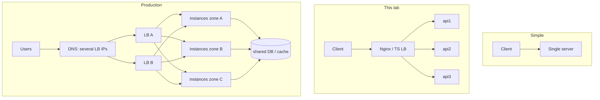

# Concepts: Load Balancing

## 1. What problem does this solve?

One server has a **capacity ceiling** and is a **single point of failure**. Running several servers fixes both, but creates new problems:

- Clients need **one stable address**, not a list of servers that changes as you scale.
- Someone must **decide which server** gets each request, and do it fairly.
- Someone must **notice dead or sick servers** and stop sending them traffic.
- You need to **add, remove and restart servers** (deploys, auto-scaling) without users noticing.

A load balancer solves all four. It's the component that makes horizontal scaling (Lab 00) possible.

## 2. How does it work?

```text
            ┌────────────── Load balancer ──────────────┐
request ──▶ │ 1. accept connection (keep-alive)          │
            │ 2. filter: which backends are healthy?     │ ◀── health checks (active/passive)
            │ 3. pick one: algorithm                     │
            │ 4. forward: rewrite headers, open/reuse    │ ──▶ backend
            │    upstream connection, stream body        │
            │ 5. on failure: mark backend, maybe retry   │
            │ 6. stream response back, log               │ ◀── response
            └────────────────────────────────────────────┘
```

The same loop in this lab's TypeScript LB ([src/lb/balancer.ts](src/lb/balancer.ts)):

```ts
for (let attempt = 1; attempt <= maxAttempts; attempt++) {
  const candidates = this.backends.filter((b) => b.healthy && !tried.has(b)); // 2. filter
  const backend = this.strategy.pick(candidates, { clientIp });             // 3. pick
  if (!backend) break;
  tried.add(backend);
  const outcome = await forward(req, res, backend, { canRetry, ... });       // 4. forward
  if (outcome.kind === "responded") return;                                  // 6. done
  this.passiveFailure(backend, outcome.reason);                              // 5. mark + retry
}
```

## 3. Important terminology

| Term | Meaning |
|---|---|
| **Backend / upstream / target** | A server behind the LB (api1, api2, api3) |
| **Pool / upstream group / target group** | The set of interchangeable backends |
| **Reverse proxy** | A server that accepts requests on behalf of backends and forwards them |
| **L4 load balancing** | Balances TCP/UDP connections, can't see HTTP |
| **L7 load balancing** | Understands HTTP, can route by path, header or cookie, and retry per request |
| **Algorithm / strategy** | Rule for picking a backend (round robin, least connections...) |
| **Health check (active)** | LB periodically calls `GET /health` on each backend |
| **Health check (passive)** | LB watches real requests fail (errors, timeouts, 5xx) |
| **Thresholds** | Consecutive failures to mark DOWN / successes to mark UP. They prevent flapping |
| **Failover** | Sending traffic to healthy backends when one fails |
| **Retry (next upstream)** | Re-sending a failed request to a different backend |
| **Sticky session / session affinity** | Same client always goes to the same backend |
| **Connection draining** | Stop new traffic to a backend, let in-flight requests finish, then remove it |
| **Keep-alive / connection pooling** | Reusing TCP connections instead of a handshake per request |
| **X-Forwarded-For** | Header carrying the real client IP through proxies |
| **TLS termination** | LB decrypts HTTPS and talks plain HTTP (or re-encrypts) to backends |

### The algorithms

**Round robin:** 1, 2, 3, 1, 2, 3...
```ts
const backend = candidates[this.counter % candidates.length];
this.counter++;
```
✅ simple, perfectly even when requests are uniform and servers are identical. ❌ blind to load: a slow server still gets 1/N of the traffic (experiment 8: p95 528ms).

**Weighted round robin:** server with weight 3 gets 3× the requests of weight 1. Use it for mixed hardware and canary releases (experiment 10: 60/20/20).

**Least connections:** pick the backend with the fewest requests in flight.
```ts
const min = Math.min(...candidates.map((b) => b.activeConnections));
const tied = candidates.filter((b) => b.activeConnections === min);
```
✅ adapts to slow servers and uneven request cost (experiment 8: 3.7× throughput). ❌ needs accurate counters, and in a single burst everyone has 0 in flight so it behaves like round robin. With many LB instances, each only sees its own connections.

**IP hash:** `hash(clientIp) % N`, so the same client always goes to the same backend.
✅ stickiness without cookies. ❌ NAT and proxies concentrate many users on one IP (experiment 9: 100% on one server). When N changes, most clients get remapped.

**Consistent hashing** (`hash $key consistent`): servers and keys sit on a hash ring, and each key goes to the next server clockwise. When a server is added or removed, only ~1/N of keys move instead of almost all of them. Used for caches and stateful routing (lab 06 builds one).

**Random / power of two choices:** random is fine at scale. "P2C" picks 2 at random and takes the one with fewer connections, which gets close to least connections' quality without global state. Envoy and Finagle use it.

**Least response time / EWMA:** prefer backends with the lowest recent latency (NGINX Plus `least_time`, Envoy, Linkerd).

### Health checks: active vs passive

```text
ACTIVE                                   PASSIVE
LB ──GET /health every 2s──▶ backend     client ──▶ LB ──real request──▶ backend
     2 failures → DOWN                                 error/timeout/5xx → count it
     2 successes → UP                                  max_fails in fail_timeout → skip
```

| | Active | Passive |
|---|---|---|
| Detects failure with no traffic | ✅ | ❌ |
| Extra load on backends | yes (small) | none |
| Real users affected while detecting | no | yes (a few) |
| Can be fooled by | a `/health` that lies | a server failing only some requests |

The state machine ([src/lb/backend.ts](src/lb/backend.ts)):

```text
   ┌────┐  unhealthyThreshold consecutive failures  ┌──────┐
   │ UP │ ────────────────────────────────────────▶ │ DOWN │
   └────┘ ◀──────────────────────────────────────── └──────┘
           healthyThreshold consecutive successes (ACTIVE checks only)
```

### Retries and idempotency

The LB can retry a failed request on another backend, but **only if repeating it is safe**:

| Method | Idempotent? | Retried by Nginx / TS LB? |
|---|---|---|
| GET, HEAD, OPTIONS | ✅ | ✅ |
| PUT, DELETE | ✅ (by spec) | Nginx yes, TS LB no (it streams bodies) |
| POST, PATCH | ❌ | ❌, unless you configure `non_idempotent` (dangerous) |

A POST that timed out may have *succeeded* on the backend. Retrying it can create a duplicate order or a double charge. That's what idempotency keys solve (lab 20).

### Timeouts

| Timeout | Nginx directive | Protects against |
|---|---|---|
| Connect | `proxy_connect_timeout 1s` | dead host (no SYN-ACK) |
| Read | `proxy_read_timeout 5s` | hung or overloaded backend |
| Total retry budget | `proxy_next_upstream_timeout 6s` | retry chains taking forever |
| Health check | `HEALTH_CHECK_TIMEOUT_MS=1000` | slow `/health` hiding a sick server |

Experiment 5 shows the cost of a 5s read timeout: a frozen server stalled everything for ~4s.

## 4. Architecture



## 5. Request lifecycle

1. Client resolves `api.example.com` to the LB's IP and connects (TLS terminates here in production).
2. LB parses the HTTP request (L7) and decides on a backend from the healthy set.
3. LB rewrites headers: `X-Forwarded-For`, `X-Real-IP`, `X-Forwarded-Proto`, `Host`. It also removes hop-by-hop headers (`Connection`, `Keep-Alive`...), which describe one connection only.
4. LB takes an idle keep-alive connection to that backend from its pool, or opens one.
5. Backend processes the request.
6. LB streams the response back (it never buffers a whole large response in memory). Nginx adds `X-Upstream-Addr`, the TS LB adds `X-Upstream`.
7. On failure (connect refused, reset, timeout, 5xx): count a passive failure, and if the method is idempotent and another backend exists, retry there. Otherwise return the error or a 502/503/504.
8. LB logs the request with the upstream address and timings.

## 6. Advantages

- Horizontal scaling: capacity grows with instances (97 → 195 → 293 req/s)
- High availability: dead instances are bypassed (0 errors when killing one)
- Zero-downtime deploys via draining
- One public endpoint, with instances free to change behind it
- A central place for TLS, compression, rate limiting, logging, routing rules

## 7. Disadvantages

- An extra hop (~1–3ms here)
- A new component to operate, and a new **single point of failure** unless made redundant
- Stateful apps break unless you add stickiness, which brings its own problems
- Retries can hide bugs and amplify load
- Misconfigured timeouts or health checks cause outages of their own (both happened during this lab)

## 8. When should we use it?

- Whenever you run **more than one instance** of a service
- Even with one instance, as a reverse proxy for TLS termination, compression and buffering slow clients
- For zero-downtime deploys, blue/green and canary releases

## 9. When should we NOT use it?

- A single internal tool with one instance and tolerance for downtime: a plain reverse proxy is enough
- Inside a service mesh or client-side LB setup (gRPC with xDS, Envoy sidecars), where a central LB would be redundant
- In front of a single-writer database primary. Use proper failover tooling instead (lab 05)

## 10. Common mistakes

| Mistake | Consequence | Instead |
|---|---|---|
| Single LB instance | LB failure = total outage | 2+ LBs or a managed LB |
| No timeouts / huge timeouts | hung backend stalls all traffic (experiment 5) | connect ~1s, read sized to the endpoint |
| Retrying POST | duplicate orders and payments | retry only idempotent requests, use idempotency keys |
| Storing sessions in memory + sticky sessions | uneven load, lost sessions when a node dies | stateless instances + Redis |
| Trusting `X-Forwarded-For` from anyone | IP spoofing, bypassing IP rate limits | only trust it from your own proxy |
| `/health` returns 200 no matter what | LB sends traffic to broken instances | check what matters (lab 17) |
| `/health` checks every dependency | one shared DB blip ejects *all* instances | separate liveness and readiness |
| Drain time < detection time | errors (or retries) on every deploy | detection < drain < grace period |
| Benchmarking all containers on one laptop | "scaling doesn't work" | understand the shared host bottleneck (experiment 3) |
| No keep-alive to backends | a TCP handshake per request, port exhaustion | `keepalive 32` + HTTP/1.1 + `Connection ""` |

## 11. Production considerations

- **LB redundancy:** active-passive with a floating IP (keepalived/VRRP), active-active behind DNS or anycast, or managed (AWS ALB is multi-AZ by default).
- **Cross-zone balancing:** spread instances across availability zones, and make sure the LB balances across zones evenly.
- **Health checks:** fast, cheap, meaningful. Interval 5–10s, timeout 1–2s, thresholds 2–3. Separate liveness and readiness.
- **Slow start:** ramp traffic to a newly added instance gradually (cold caches, JIT warm-up). NGINX Plus `slow_start`, Envoy `slow_start_config`.
- **Connection draining / deregistration delay:** AWS ALB defaults to 300s. Set it to roughly your longest request.
- **Limits:** `max_conns` per backend, `worker_connections`, file descriptors (`ulimit -n`).
- **Observability:** per-backend request rate, error rate, latency, and health state. Log `$upstream_addr`.
- **TLS:** terminate at the LB, keep certificates in one place, consider re-encryption to backends for zero-trust networks.
- **Security:** the LB is your edge. Put request size limits, header limits, rate limiting (lab 07) and a WAF here.
