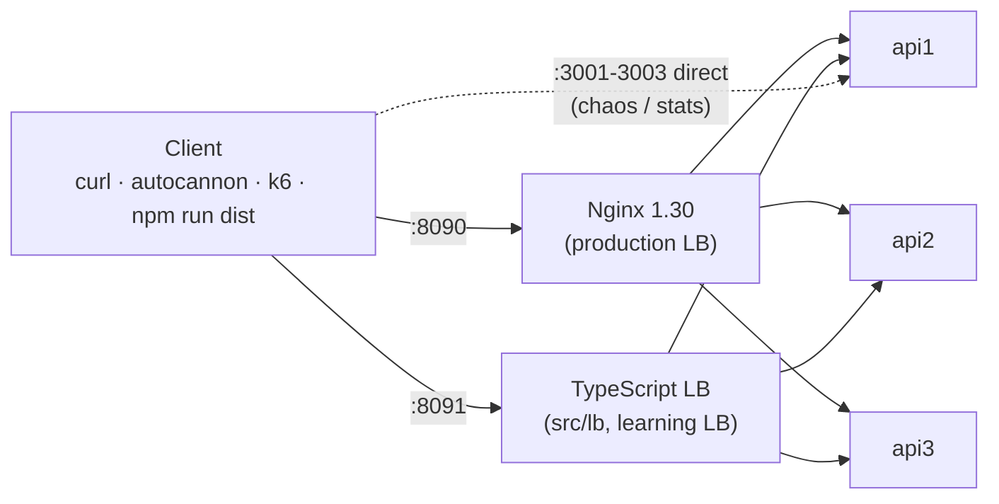

# Lab 01: Load Balancer

> Reverse proxy · Horizontal scaling · Round robin · Least connections · IP hash · Weighted · Consistent hash · Active vs passive health checks · Retries · Connection draining · Nginx

In Lab 00 one server had a hard ceiling, and when it died, users died with it. A **load balancer** lets you run many identical servers and makes them look like one.

---

## Goal

By the end of this lab you will be able to:

- Explain what a load balancer and a reverse proxy are, and why every production system has one
- Show throughput scaling **linearly** from 1 → 2 → 3 instances (measured: 97 → 195 → 293 req/s)
- Compare **round robin, least connections, IP hash, weighted, consistent hash**, and know when each one wins
- Tell **active** health checks from **passive** ones, and see each catch failures the other misses
- Watch a load balancer **hide** a crashed instance (0 errors), and a **hung** instance freeze all traffic for 5s
- Implement **graceful shutdown / connection draining** so deploys cause zero errors
- Explain why **sticky sessions** are a workaround and **stateless servers** are the fix
- Read a real Nginx config line by line, **and** a ~400-line load balancer written in TypeScript

## Prerequisites

- [Lab 00](../00-basics/) concepts: latency, throughput, Little's Law, availability
- Node.js 22+, Docker Desktop (Compose v2+), Git Bash on Windows
- Free ports: **8090** (Nginx), **8091** (TS load balancer), **3001–3003** (direct access to instances)

---

## System Design Concept

A **load balancer (LB)** sits between clients and a group of identical servers (a *pool*, *upstream* or *target group*). Clients only know the LB's address. For every request, the LB:

1. **picks** a healthy server using an algorithm (round robin, least connections...)
2. **forwards** the request to it (it's a *reverse proxy*: it acts on behalf of the servers)
3. **streams** the response back
4. **watches** for failures and stops sending traffic to broken servers

**Analogy:** a restaurant host. Guests (requests) don't pick a waiter. The host seats them at whichever section has a free waiter (algorithm), skips the waiter who's on break (health check), and the guests never need to know how many waiters there are (abstraction).

**Reverse proxy vs forward proxy:** a *forward* proxy acts for **clients** (corporate proxy, VPN), and the server doesn't know who the client is. A *reverse* proxy acts for **servers**, and the client doesn't know which server answered. A load balancer is a reverse proxy with several backends.

**L4 vs L7:**
| | Layer 4 (transport) | Layer 7 (application) |
|---|---|---|
| Sees | IP + port, TCP/UDP | HTTP: method, path, headers, cookies |
| Can route by | connection | URL, header, cookie, user |
| Examples | AWS NLB, HAProxy (TCP mode), IPVS | **Nginx (this lab)**, AWS ALB, Envoy, Traefik |
| Cost | very cheap, fast | parses HTTP, more CPU, more features |

## Why does this problem exist?

Lab 00 showed one server has:
- **a capacity ceiling:** one instance with a pool of 10 DB connections serves ~100 req/s, period
- **a single point of failure:** it crashes, you're down
- **no safe way to deploy:** restarting it means downtime

You can buy a bigger server (vertical scaling) only up to a point. The alternative is many servers (horizontal scaling), but then **clients need one address**, and **someone must decide which server gets each request** and **stop using dead ones**. That someone is the load balancer.

## Real-world examples

- **Every cloud:** AWS ALB/NLB, Google Cloud Load Balancing, Azure Load Balancer. You rarely run a web app without one.
- **Nginx / HAProxy / Envoy** in front of app servers. Nginx powers a large share of the world's busiest sites.
- **Kubernetes:** a `Service` load-balances across pods (L4 via kube-proxy/IPVS), and an `Ingress` does L7 routing.
- **Netflix, Uber, Lyft:** client-side load balancing and Envoy service meshes, the same algorithms running inside every service.
- **Canary deploys:** weighted routing sends 1–5% of traffic to the new version first.

---

## Architecture



- **Nginx (:8090):** what you'd run in production. 5 strategies, passive health checks, retries, DNS-based discovery of instances.
- **TypeScript LB (:8091):** the same ideas in readable code, plus **active** health checks (which open-source Nginx doesn't have).
- **api1–3:** identical Express apps, 1 CPU each, each with a pool of 10 simulated DB connections (~100 req/s capacity).

Full explanation: [ARCHITECTURE.md](ARCHITECTURE.md) · Code structure: [docs/architecture.md](docs/architecture.md)

## Request Flow

```text
Client ── GET /work ──▶ Nginx :8090
                         │ 1. pick server (round robin → api2)
                         │ 2. reuse a keep-alive TCP connection to api2
                         │ 3. add X-Forwarded-For / X-Real-IP
                         ▼
                        api2 :3000
                         │ 4. wait for a pool slot, "query" 100ms
                         ▼
                        Nginx ── on error/timeout/5xx: retry on api3 (GET only)
                         │ 5. add X-Upstream-Addr header, log upstream + timings
                         ▼
Client ◀── 200 + X-Instance: api2
```

Hop-by-hop walkthrough with every failure point: [docs/request-flow.md](docs/request-flow.md).

## Implementation

```text
01-load-balancer/
├── nginx/
│   ├── nginx.conf                     # workers, JSON access log, DNS resolver
│   ├── templates/default.conf.template# proxy settings, timeouts, retries, debug headers
│   └── upstreams/                     # one file per strategy:
│       ├── round-robin.conf  least-conn.conf  ip-hash.conf  weighted.conf  hash.conf
├── src/
│   ├── api/                           # the backend service (Express)
│   │   ├── server.ts                  # graceful shutdown / draining
│   │   ├── app.ts  config.ts  errors.ts
│   │   ├── routes/  controllers/      # whoami, work, cpu, health, cart, admin
│   │   ├── middleware/                # chaos, request tracking, errors
│   │   └── services/                  # instance state, resource pool, cpu
│   ├── lb/                            # the TypeScript load balancer (node:http, no framework)
│   │   ├── strategies.ts              # round robin, least connections, ip hash, random
│   │   ├── backend.ts                 # UP/DOWN state machine with thresholds
│   │   ├── health-checker.ts          # ACTIVE health checks
│   │   ├── proxy.ts                   # reverse proxy: headers, streaming, timeouts
│   │   ├── balancer.ts                # pick → proxy → passive check → retry
│   │   └── server.ts  config.ts
│   └── shared/                        # logger, env helpers
├── scripts/
│   ├── distribution.ts                # "which instance answered?" + live --watch mode
│   └── dev-local.ts                   # run 3 APIs + TS LB without Docker
├── tests/                             # 41 tests: unit + real-HTTP integration
├── k6/load-test.js
├── Dockerfile                         # one image, two programs (api / lb)
└── docker-compose.yml                 # nginx, node-lb, api1-3
```

### API endpoints (on every instance)

| Endpoint | Purpose |
|---|---|
| `GET /` | Who answered? instance, request number, in-flight count |
| `GET /work?ms=100` | Simulated DB query using a pool of 10 connections (capacity ≈ 100 req/s per instance) |
| `GET /cpu?n=30` | CPU-bound work (fibonacci) |
| `GET /health` | Health check: 503 when chaos=`unhealthy` or while shutting down |
| `POST /cart/items` · `GET /cart` | In-memory cart (header `X-User-Id`), a deliberate stateful anti-pattern |
| `GET /admin/stats` · `POST /admin/stats/reset` | Per-instance counters and pool usage |
| `POST /admin/chaos` `{"mode":"healthy|error|slow|unhealthy","slowMs":2000}` | Break this instance on purpose |
| `POST /admin/crash` | Exit the process |

### Load balancer endpoints

| Endpoint | LB |
|---|---|
| `GET /lb-health` | Nginx's own health, shows the active strategy |
| `GET /nginx_status` | Nginx connection counters |
| `GET /lb/status` | TS LB: every backend's health, active connections, errors |
| `POST /lb/strategy?name=least-connections` | TS LB: switch algorithm at runtime |
| `GET /lb/health` | TS LB's own health |

---

## How to Run

```bash
cd 01-load-balancer
npm install                  # install dependencies

# Option A: full lab with Docker (Nginx + TS LB + 3 APIs)
docker compose up --build -d # build the image, start 5 containers in the background
docker compose ps            # wait until all 5 show (healthy)
curl -s localhost:8090/      # through Nginx
curl -s localhost:8091/      # through the TypeScript LB

# Option B: without Docker (3 APIs + TS LB as local processes, no Nginx)
npm run dev                  # api1-3 on 3001-3003, LB on 8091. Ctrl+C stops all

# Build / production mode
npm run build                # compile src/ → dist/ with strict type-checking
npm run start:api            # run one API instance from dist/
npm run start:lb             # run the TS LB from dist/
```

Switch the **Nginx** strategy (recreates only the Nginx container):

```bash
NGINX_STRATEGY=least-conn docker compose up -d --no-deps nginx   # round-robin | least-conn | ip-hash | weighted | hash
curl -s localhost:8090/lb-health                                  # {"status":"ok","strategy":"least-conn"}
```

Switch the **TypeScript LB** strategy (at runtime, no restart):

```bash
curl -s -X POST "localhost:8091/lb/strategy?name=least-connections"   # round-robin | least-connections | ip-hash | random
```

Stop everything:

```bash
docker compose down          # stop and remove containers + network
docker compose down -v       # same + volumes (this lab has no named volumes, only read-only bind mounts)
```

## How to Test

```bash
npm test                     # 41 tests (vitest), ~10s
npm run typecheck            # strict type-check of src + tests + scripts
npm run dist -- --n 300      # see the traffic distribution through Nginx
```

The tests start **real HTTP servers** (3 APIs + the TS LB on random ports) and check: even round-robin distribution, retry hiding a failing backend, passive and active health checks, no retry for POST, 503 when everything is down, failover on connection refused, least-connections avoiding a slow backend under sustained load, ip-hash stickiness, and a regression test for a health-check bug found during the experiments.

## Experiments

Step-by-step commands and full output: **[EXPERIMENTS.md](EXPERIMENTS.md)**. Measured on a Windows laptop:

| # | Experiment | Result |
|---|---|---|
| 1 | Baseline: what does the LB cost? | Nginx adds **~1–3ms** per request |
| 2 | Scale 1 → 2 → 3 instances | **97 → 195 → 293 req/s**, p50 **1016 → 508 → 325ms** |
| 3 | CPU-bound scaling on one laptop | 66 → 70 req/s: the *host* is the bottleneck, not the instances |
| 4 | Kill an instance (`docker kill`) | **0 errors** for users, a 2s p99 blip, then traffic on 2 instances |
| 5 | Freeze an instance (`docker compose pause`) | **all traffic stalled ~4s** (max 5027ms), even with active checks. A 1s proxy timeout cut it to ~1s |
| 6 | Instance returns 500s | Nginx retries elsewhere: **0 of 300** requests fail |
| 7 | Health endpoint lies (`unhealthy`) | Nginx keeps sending (passive only). TS LB ejects it (active) |
| 8 | One slow instance: round robin vs least_conn | **97 vs 362 req/s**, p95 **528 vs 55ms** |
| 9 | Sticky sessions & the in-memory cart | round robin scatters the cart. `hash` keeps it. `ip_hash` sends 100% to one server |
| 10 | Weighted routing (canary) | 3:1:1 weights → exactly **60/20/20** |
| 11 | Graceful shutdown under load | after 3 fixes: active check ejects at +3.9s, exit at +6s, **0 errors, 0 retries** |
| 12 | k6 load test | 213 req/s, p95 128ms, 2493/2492/2492 split, all thresholds pass |

## What happens if X fails?

| Failure | What users see (measured) | Why | Mitigation |
|---|---|---|---|
| One instance crashes | Nothing: 0 errors, small latency blip | Connection refused/reset → LB retries GET on another instance, marks it down | ≥2 instances, retries for idempotent requests |
| One instance **hangs** | Requests stall up to `proxy_read_timeout` (5s) | LB can only tell a hung server from a slow one by waiting | Short timeouts, active health checks with timeouts, least_conn |
| One instance returns 500s | Nothing (GET). The error is passed through for POST | `proxy_next_upstream http_500` retries idempotent requests only | Fix the bug. Retries buy time |
| `/health` fails but traffic works | Nginx OSS: nothing changes. Active LB: instance removed | Passive checks only watch real traffic | Decide what `/health` should mean (lab 17) |
| Instance deployed / restarted | 0 errors *if* draining is configured correctly | `/health`=503 → LB stops sending → in-flight finish → exit | DRAIN > detection time, grace period > drain |
| **The load balancer itself dies** | **Total outage** | The LB is now the single point of failure | 2+ LBs with a floating IP (keepalived/VRRP), DNS with multiple IPs, or a managed cloud LB |
| All instances down | Nginx 502, TS LB 503 `NO_HEALTHY_BACKENDS` | Nothing to route to | Alerting, auto-scaling, backups in another zone |
| DNS for an instance is slow | LB keeps using the stale IP | `resolver_timeout` < DNS response time (we hit this) | Tune resolver timeouts, or use a service registry (lab 16) |

## Scaling

```text
Simple                                   Production
──────                                   ──────────
1 Nginx  → 3 containers on 1 laptop      DNS (multiple LB IPs, latency/geo routing)
                                           → 2+ LBs per region (active-active / floating IP)
                                             → N instances across 3 availability zones
                                               → auto-scaling on CPU / RPS / queue depth
```

- **Instances scale linearly** while they don't share a bottleneck (2 → 195 req/s, 3 → 293 req/s). They stop scaling when the shared database, cache, or the host itself saturates (experiment 3).
- **The LB itself scales** far beyond the apps: Nginx is event-driven like Node, and one core handles tens of thousands of simple proxied req/s. At very large scale: L4 LBs in front of L7 LBs, DNS spreading traffic over several LB IPs, anycast.

## Bottlenecks

- **Shared dependencies:** the database behind all instances (labs 02–06 address this).
- **The host:** containers on one machine share its CPU. This laptop's 15W CPU throttled to 802 MHz, so CPU-bound work didn't scale (experiment 3).
- **The LB:** connection limits (`worker_connections`), CPU for TLS termination, bandwidth.
- **State in instances:** in-memory carts and sessions force sticky routing, which causes uneven load (experiment 9).
- **Hash-based stickiness:** few distinct keys means uneven distribution (50 users split 44/28/28%).

## Trade-offs

| Decision | Gain | Cost |
|---|---|---|
| Add a load balancer | horizontal scaling, failover, zero-downtime deploys | an extra hop (~1–3ms), a new component that can fail |
| Round robin | simple, predictable, perfectly even for equal requests | blind to slow servers (33% of traffic to a slow server) |
| Least connections | adapts to slow servers and uneven request cost | needs shared counters, and in a burst it behaves like round robin |
| IP hash / sticky | lets stateful apps "work" | uneven load, NAT hotspots, users stranded when a server dies |
| Retries in the LB | hides instance failures | extra load, dangerous for non-idempotent requests |
| Short timeouts | fast failover from hung servers | false positives for legitimately slow requests |
| Active health checks | detect problems with zero traffic, auto-recover | extra load on backends, `/health` may lie |

Full analysis: [docs/trade-offs.md](docs/trade-offs.md).

## Production Considerations

- **Never one LB:** run two (active-passive with a floating IP, or active-active behind DNS), or use a managed LB (AWS ALB/NLB, GCP LB) that's redundant by design.
- **Health checks:** check what matters (lab 17), with tight timeouts (1–2s), thresholds of 2–3, and intervals of 5–10s.
- **Timeouts at every hop:** connect (≈1s), read (based on your slowest legit endpoint), and an overall request deadline. Experiment 5 shows why.
- **Retries:** only idempotent requests, max 1–2, with a budget (lab 19). Never retry POST payments without idempotency keys (lab 20).
- **Graceful shutdown:** `DRAIN_MS` greater than LB detection time (interval × threshold + interval), and the orchestrator grace period (`stop_grace_period`, Kubernetes `terminationGracePeriodSeconds`) greater than drain + longest request.
- **TLS termination** at the LB, which centralizes certificates and offloads crypto from apps.
- **Forwarded headers:** apps must use `X-Forwarded-For` / `X-Real-IP` for the client IP, but **only trust them from your own proxy** (spoofable otherwise).
- **Stateless apps** instead of sticky sessions (lab 22).
- **Observability:** log `$upstream_addr`, `$upstream_response_time`, per-backend error rates (lab 21).
- **Connection limits & keep-alive** to backends: avoids a TCP handshake per request.

## Interview Questions

15+ questions with answers: **[INTERVIEW.md](INTERVIEW.md)**. A sample:

- What's the difference between L4 and L7 load balancing?
- Round robin vs least connections: when does least connections win, and when does it *not* help?
- How do you avoid the load balancer becoming a single point of failure?
- How do you deploy a new version with zero failed requests?
- Why are sticky sessions considered an anti-pattern?

## Key Takeaways

1. **A load balancer turns N servers into one address.** Capacity scales with N as long as nothing behind them is shared and saturated.
2. **The algorithm matters when servers or requests differ.** Least connections beat round robin 3.7× with one slow server.
3. **A dead server is easy, a hung server is hard.** Connection refused fails over instantly; silence costs a full timeout.
4. **Passive checks see real failures, active checks see `/health`.** Each misses things the other catches.
5. **Retries make failures invisible**, but only for idempotent requests, and they add load.
6. **Zero-downtime deploys are a timing problem:** detection < drain < grace period. We got it wrong twice before it worked.
7. **Sticky sessions are a crutch.** Make servers stateless and any instance can serve anyone.
8. **The LB is a new single point of failure.** Plan its redundancy too.

Next lab: [02-caching](../02-caching/). The database behind the instances becomes the next bottleneck, so we put a cache in front of it.
