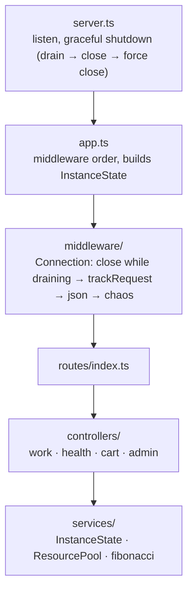
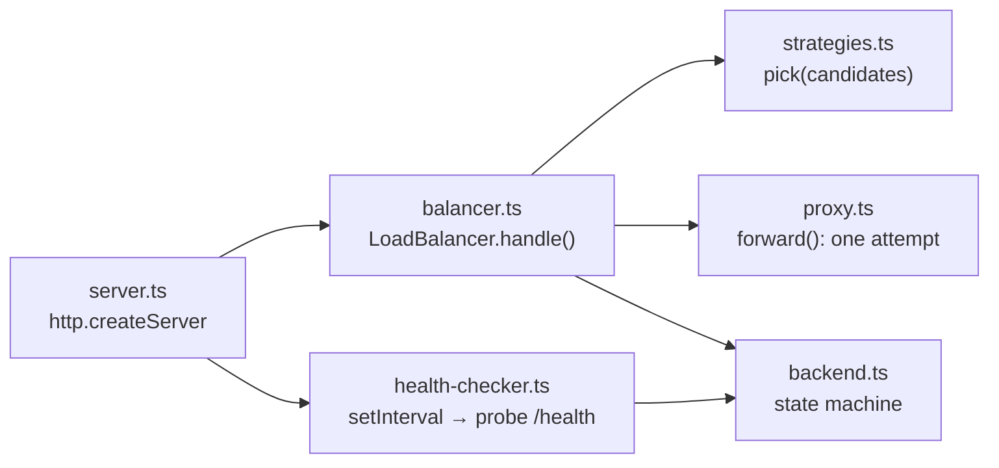

# Code Architecture

Two programs share one package and one Docker image:

```text
src/
├── api/      the backend service (Express 5)       → dist/api/server.js
├── lb/       the TypeScript load balancer (node:http) → dist/lb/server.js
└── shared/   logger + env helpers used by both
```

## The API (`src/api`)



Middleware order and why it matters:

| # | Middleware | Why here |
|---|---|---|
| 1 | `Connection: close` while shutting down | Applies to every response, including errors |
| 2 | `trackRequest` | Counts *every* request in `inFlight` and sets `X-Instance`, even chaos failures |
| 3 | `express.json()` | Body parsing for `/cart` and `/admin/chaos` |
| 4 | `chaos` | After tracking (so failures are counted), skips `/admin/*` (so you can always heal the instance) |
| 5 | routes | |
| 6 | `notFound`, `errorHandler` | Last |

`InstanceState` holds everything one instance keeps in memory: counters, chaos mode, carts, and the `ResourcePool`. Creating it inside `createApiApp()` means every test gets a fresh instance.

### ResourcePool: a semaphore

```ts
async acquire(): Promise<() => void> {
  if (this.active < this.size) this.active += 1;
  else await new Promise<void>((resolve) => this.queue.push(resolve)); // wait in line
  return () => {                           // release
    const next = this.queue.shift();
    if (next) next();                      // hand the slot directly to the next waiter
    else this.active -= 1;
  };
}
```

It models a database connection pool: at most `size` requests do "work" at once, and the rest queue. That gives each instance a clear capacity (`size / queryTime`), which is what makes experiment 2 scale cleanly.

## The load balancer (`src/lb`)



| File | Lines (approx.) | Responsibility |
|---|---|---|
| `strategies.ts` | 120 | `Strategy` interface + round robin, least connections, ip hash, random. Pure functions of the candidate list, easy to unit-test |
| `backend.ts` | 70 | `Backend` data + `recordSuccess` / `recordFailure` with thresholds. Returns `"went-up"` / `"went-down"` so callers can log transitions |
| `health-checker.ts` | 90 | Active checks. The probe function is injectable, so tests don't need a network |
| `proxy.ts` | 150 | One proxy attempt: header rewriting, hop-by-hop removal, streaming, timeouts, client-abort handling |
| `balancer.ts` | 190 | The loop: filter healthy → pick → forward → passive failure → retry. Plus `/lb/*` admin routes |
| `server.ts` | 60 | Wiring and graceful shutdown |

### Design decisions

**`forward()` returns an outcome instead of throwing.**
```ts
type ProxyOutcome = { kind: "responded"; statusCode: number } | { kind: "failed"; reason: string };
```
"Failed" guarantees nothing was written to the client yet, so the balancer may safely retry. Once headers are sent, a retry is impossible: half a response is already on the wire.

**Retry only GET/HEAD.** Request bodies are *streamed* (`req.pipe(upstreamReq)`), so they can be sent only once. Buffering bodies would allow replaying PUT/DELETE, but costs memory. Nginx buffers small bodies, which is why it can retry PUT.

**`canRetry` is only true when another healthy backend exists.** On the last attempt, a backend's 5xx is streamed to the client unchanged instead of being swallowed.

**Proxied successes don't count as health successes.** This was a bug found in experiment 11: successful requests kept resetting the failure streak, so a draining instance (503 on `/health`) was never removed. Now only active checks restore a backend. A regression test covers it.

**Keep-alive agent.** `new http.Agent({ keepAlive: true, maxSockets: 512 })` reuses TCP connections to backends: no handshake per request, and no running out of ephemeral ports under load.

**`clientIpOf()` trusts `X-Forwarded-For`.** It's convenient for experiments (simulate many clients) but **a security hole on the open internet**. Real LBs only trust it from configured proxy IPs.

## Nginx config (`nginx/`)

```text
nginx.conf                       main: workers, JSON log format, resolver
templates/default.conf.template  server block: proxy_pass, headers, timeouts, retries
upstreams/<strategy>.conf        one upstream block per algorithm
```

Splitting upstreams into files keeps each strategy readable on its own, and lets one env var switch between them without editing config.

## Tests (`tests/`)

| File | Type | Covers |
|---|---|---|
| `strategies.test.ts` | unit | each algorithm, tie-breaking, ip-hash spread and remapping |
| `health.test.ts` | unit | thresholds, flapping protection, active checker with a fake probe |
| `api.test.ts` | HTTP (supertest) | endpoints, chaos modes, draining (`503` + `Connection: close`), cart |
| `resource-pool.test.ts` | unit + HTTP | semaphore behaviour, queueing caps throughput |
| `balancer.integration.test.ts` | real HTTP | 3 real API servers + real LB on random ports: distribution, retries, passive/active checks, POST not retried, 503, failover, least-conn under sustained load, ip-hash, regression |
