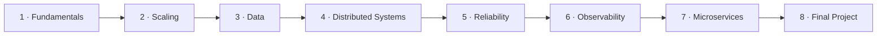

# Roadmap

Eight phases, 25 labs. Each phase answers one question about building systems that are fast, available and correct at scale.



---

## Phase 1: Fundamentals
**Question:** how do we describe and measure a system?

| Lab | Key ideas | Builds toward |
|---|---|---|
| [00-basics](00-basics/) | latency (p50/p95/p99), throughput, Little's Law, bandwidth, availability math, reliability, fault tolerance, vertical vs horizontal, CAP | the vocabulary for every other lab |

✅ **Exit check:** you can explain why p99 matters, compute series/parallel availability, and explain why one Node process doesn't use extra cores.

## Phase 2: Scaling
**Question:** how do we handle more traffic than one server can?

| Lab | Key ideas |
|---|---|
| [01-load-balancer](01-load-balancer/) | Nginx reverse proxy, round robin, least connections, passive/active health checks |
| 22-horizontal-scaling | stateless services, shared sessions in Redis, scaling to N instances |
| 13-cdn | edge caching, origin offload, TTL, invalidation |

✅ **Exit check:** you can draw client → LB → N stateless APIs → shared state, and say what happens when one API dies.

> 22 is listed here because it's conceptually about scaling. Do it after 03-redis, since it uses Redis for sessions.

## Phase 3: Data
**Question:** how do we store and read data fast, and keep it when machines fail?

| Lab | Key ideas |
|---|---|
| 02-caching | cache-aside, read/write-through, write-back, TTL, stampede, stale data |
| 03-redis | strings, hashes, lists, sets, sorted sets, counters, locks |
| 04-database-index | full scan vs B-tree, composite index, EXPLAIN ANALYZE |
| 05-database-replication | primary/replica, read/write splitting, replication lag, failover |
| 06-database-sharding | shard key, consistent hashing, hot partitions, resharding |
| 12-search | inverted index, full-text, relevance, autocomplete |
| 14-object-storage | buckets, objects, presigned URLs, multipart upload |

✅ **Exit check:** given a read-heavy workload, you can choose between index, cache, replica and shard, and justify the choice.

## Phase 4: Distributed Systems
**Question:** how do separate processes communicate reliably?

| Lab | Key ideas |
|---|---|
| 07-rate-limiting | fixed window, sliding window, token bucket, distributed counters in Redis |
| 08-message-queue | producer/consumer, ack, retry, DLQ, backpressure (RabbitMQ) |
| 09-kafka | topics, partitions, offsets, consumer groups, ordering |
| 10-websocket | persistent connections, rooms, the scaling problem |
| 11-pub-sub | fan-out between instances with Redis Pub/Sub |
| 16-service-discovery | static config vs DNS vs registry |

✅ **Exit check:** you can explain queue vs log (RabbitMQ vs Kafka), and how to scale WebSockets across instances.

## Phase 5: Reliability
**Question:** how do we stay up when dependencies fail?

| Lab | Key ideas |
|---|---|
| 17-health-check | liveness vs readiness vs health, dependency checks |
| 18-circuit-breaker | CLOSED / OPEN / HALF_OPEN, failure thresholds |
| 19-retry-timeout | timeouts, exponential backoff, jitter, retry storms |
| 20-idempotency | Idempotency-Key, exactly-once *effects* |

✅ **Exit check:** you can design a payment call that survives timeouts without double-charging.

## Phase 6: Observability
**Question:** how do we know what's happening in production?

| Lab | Key ideas |
|---|---|
| 21-observability | structured logs, request/correlation IDs, Prometheus metrics, Grafana dashboards, RED/USE methods |

✅ **Exit check:** you can find which instance and which dependency caused a p99 spike, from dashboards alone.

## Phase 7: Microservices
**Question:** when and how do we split a system into services?

| Lab | Key ideas |
|---|---|
| 15-api-gateway | routing, auth, rate limiting, request transformation at the edge |
| 23-microservices | service boundaries, per-service packages and Dockerfiles, inter-service calls |

✅ **Exit check:** you can argue *against* microservices for a small team, and describe what you'd need before adopting them.

## Phase 8: Final Project
**Question:** can you combine everything into one coherent system?

| Lab | Key ideas |
|---|---|
| 24-final-project | scalable e-commerce backend: gateway, user/product/order services, Redis, PostgreSQL, Kafka, workers, health checks, retries, circuit breaker, idempotency, metrics |

✅ **Exit check:** you can walk an interviewer through the whole architecture, every failure mode, and every trade-off.

---

## Suggested build / study order

The folders are numbered by topic, but some labs depend on others. Recommended order:

```text
00 → 01 → 02 → 03 → 04 → 05 → 06 → 07 → 22 → 08 → 09 → 10 → 11
   → 17 → 18 → 19 → 20 → 21 → 12 → 13 → 14 → 15 → 16 → 23 → 24
```

## Progress

- [x] 00-basics
- [x] 01-load-balancer
- [ ] 02-caching
- [ ] 03-redis
- [ ] 04-database-index
- [ ] 05-database-replication
- [ ] 06-database-sharding
- [ ] 07-rate-limiting
- [ ] 08-message-queue
- [ ] 09-kafka
- [ ] 10-websocket
- [ ] 11-pub-sub
- [ ] 12-search
- [ ] 13-cdn
- [ ] 14-object-storage
- [ ] 15-api-gateway
- [ ] 16-service-discovery
- [ ] 17-health-check
- [ ] 18-circuit-breaker
- [ ] 19-retry-timeout
- [ ] 20-idempotency
- [ ] 21-observability
- [ ] 22-horizontal-scaling
- [ ] 23-microservices
- [ ] 24-final-project
